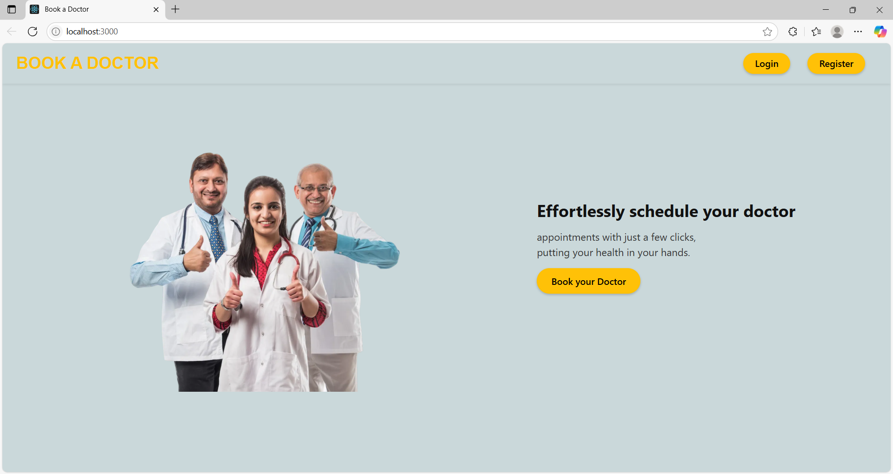
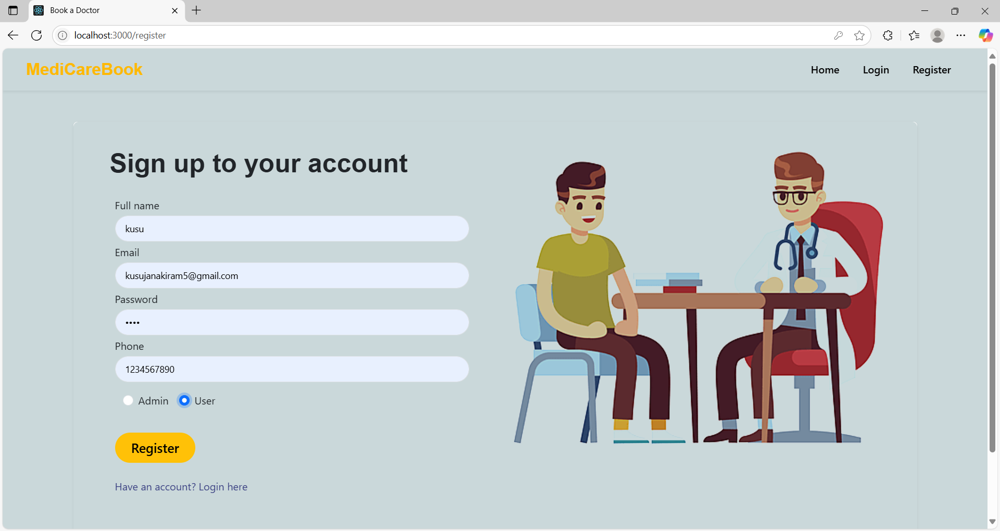
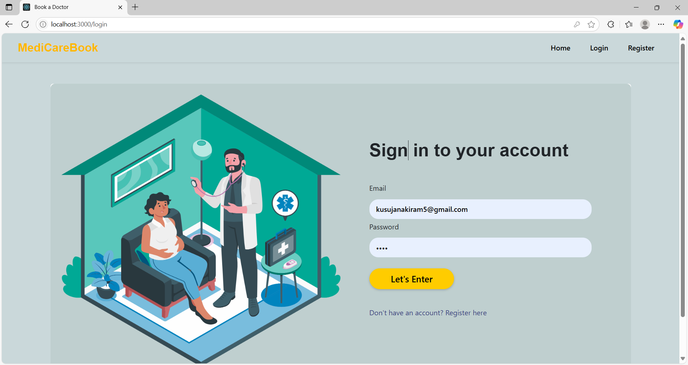
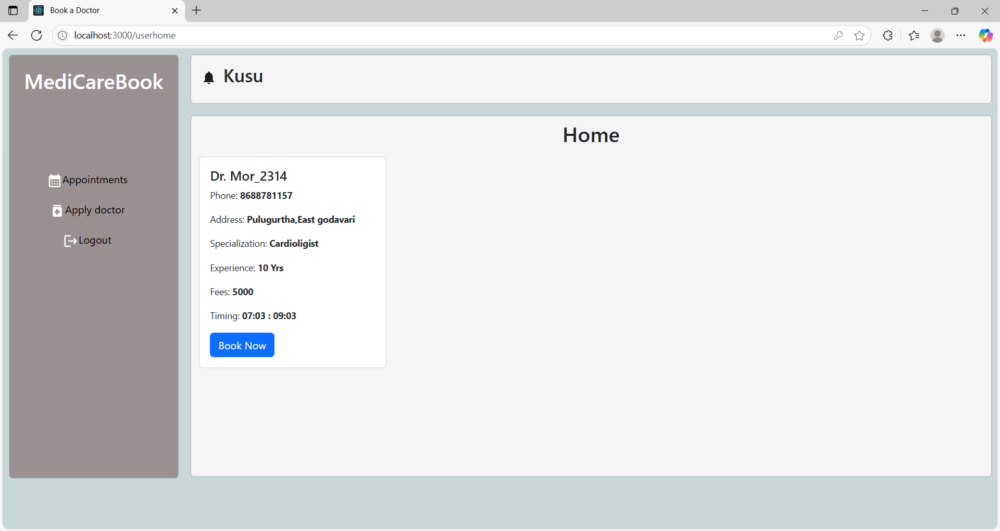
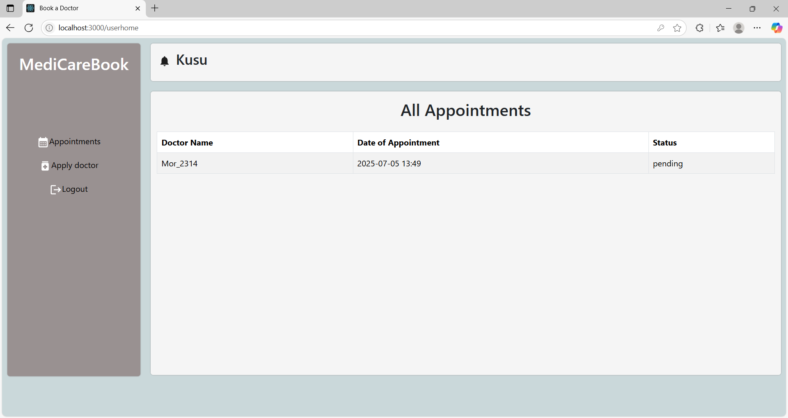
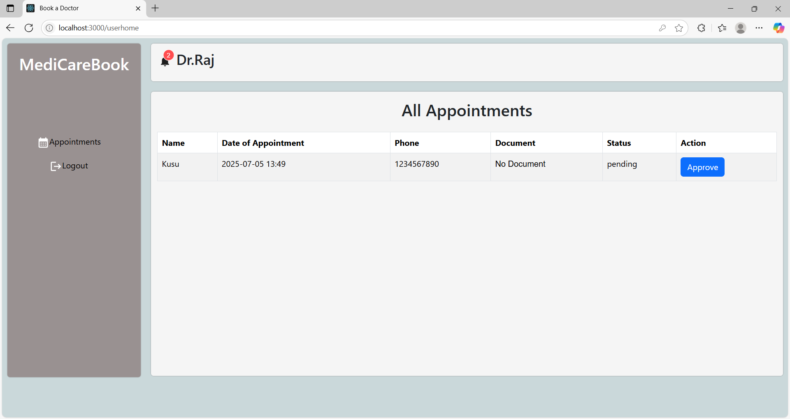
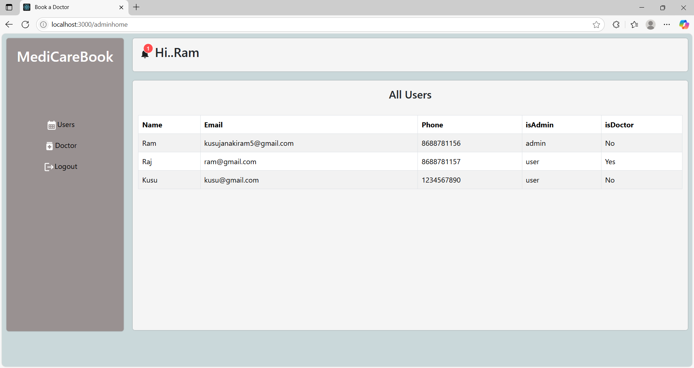

# 🩺 DocSpot – Doctor Appointment App

A simple and efficient full-stack doctor appointment booking system that allows patients to book, manage, and track doctor visits, and enables doctors and admins to streamline appointment workflows.

---

## 🚀 Features

- 👨‍⚕️ Doctor, Patient & Admin Login
- 📅 Book, Reschedule, and Cancel Appointments
- 📤 Upload Documents for Appointments
- ✅ Admin Approval for New Doctors
- 🕒 Real-Time Slot Availability
- 📬 Email Notifications (can be extended)
- 📜 View Appointment & Booking History
- 📱 Responsive & Modern UI (Web + Mobile Friendly)

---

## 🛠️ Tech Stack

- **Frontend**: React, React Router, MDB UI Kit, Bootstrap  
- **Backend**: Node.js, Express.js  
- **Database**: MongoDB (via MongoDB Atlas)  
- **Authentication**: JWT (JSON Web Tokens)  

---

## 📸 Screenshots

| Home | Register | Login |
|------|----------|-------|
|  |  |  |

| User Dashboard | Book Appointment | Doctor Dashboard |
|----------------|------------------|------------------|
|  |  |  |

| Admin Dashboard |
|-----------------|
|  |

---

## Installation

1. Clone the repository:

  ```bash
  git clone https://github.com/kusujanakiram/DocSpot.git  
  cd doctor-appointment-app
   ```

2. Install dependencies:
   ```bash
   npm install
   ```

3. Set up environment variables:
   Create a `.env` file and add your configuration:
   ```env
   DB_URI=your_database_uri
   JWT_SECRET=your_secret
   ```

4. Start the development server:
   ```bash
   npm start
   ```

## 🧪 Testing

Run tests using:
```bash
npm test
```

## 📌 Future Enhancements

- 👨‍⚕️ Doctor Profile Management
- 💬 In-App Chat with Doctor
- 📆 Calendar Sync (Google/Outlook)
- 💳 Payment Gateway Integration
- 🗣️ Multi-Language Support

## 🐞 Known Issues

- No calendar sync yet.
- No push notification support (mobile).
- UI glitches on very small screen sizes.

## 🤝 Contributing

Contributions are welcome!  
Please fork the repository and submit a pull request.

## 📄 License

This project is licensed under the MIT License.

🔗 Drive : [Project Report Link](https://drive.google.com/drive/folders/1DLBsG5atRfnFId1Zuu9C-YDTnlb8wZnp)

🌐 Live Demo : [Demo Video Link ](https://drive.google.com/file/d/15qjKaZwaqULzqjYv2nuQnFOqPgyx15fo/view?usp=sharing)
